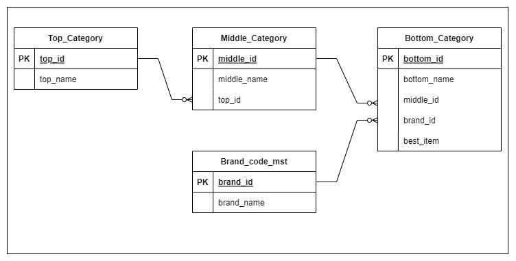

# category_project


### 개발환경

----

- Java 8
- Spring-boot v2.6.1
- H2 (Mybatis)
- Maven
- Junit


### 순서

---

1. [ERD](#ERD)
2. [기본 프로그램 설치](#기본-프로그램-설치)
3. [프로젝트 빌드](#프로젝트-빌드)
4. [REST API 구성](#REST-API-구성)
5. [Linux 환경에서 REST API 테스트 방법](#Linux 환경에서-REST-API-테스트-방법)
6. [Junit sample code](#Junit-sample-code)


### ERD

---



- 아래의 내용을 담은 테이블을 구성했습니다.

  - __top_category__ : 상위 level로 기본 품목을 나타냅니다.

    ex) 상의, 아우터, 바지, 신발, 가방 etc..

  - __middle_category__ : 중위 level로 기본 품목에서 파생되는 세부 카테고리입니다.

    ex)  상의 - 반팔 티셔츠, 긴팔 티셔츠, 민소매 티셔츠 etc ...

  - __bottom_category__ : 세부품목을 나타내는 카테고리입니다.

    ex) 상의 - 반팔티셔츠 - [무신사 스텐다드] 레이어드 크루 넥 반팔 티셔츠

  - __brand_code_mst__ : 세부 품목에 사용되는 brand 정보가진 meta data 테이블 입니다.


### 기본 프로그램 설치

----

__1. 자바 설치 및 설정__

- 자바 설치

   ```
       # install jre
       apt-get install openjdk-8-jre
       
       # install jdk
       apt-get install openjdk-8-jdk
   ```

-  자바 설정

   ```
       # edit profile
       vi /etc/profile
   ```

   ```
       export JAVA_HOME=/usr/lib/jvm/java-8-openjdk-amd64
       export PATH=JAVAHOME/bin:PATH
       export CLASS_PATH=JAVAHOME/lib:CLASS_PATH
   ```

- 자바 설치 확인

   ```
       # reload setting
       source /etc/profile
       
       # check java
       java -version
   ```


__2. 메이븐 설치 및 설정__

- 메이븐 설치

  ```null
  	# install maven
  	apt install maven
  ```


### 프로젝트 빌드

---

1. 프로젝트 소스 받기

   ```
   	# 설치하고자 하는 위치에서 실행
   	git clone https://github.com/remme1234/category_project.git
   ```


2. 프로젝트 빌드

   ```
   	# 해당 프로젝트로 이동
   	cd ./category_project/musinsa_category/
   	
   	# 빌드
   	mvn pacakge
   	
   	# 빌드 결과 확인
   	ll ./target/musinsa_category-0.0.1-SNAPSHOT.war
   ```

   

3. 프로젝트 실행

   ```
   	# 프로젝트 실행
   	java -jar ./target/musinsa_category-0.0.1-SNAPSHOT.war
   ```

   


### REST API 구성

-----

__현재 구성된 cotroller 별 REST API 구성__

- Top_Category

  ```
  #GET
  	/top-category/{topId} : 카테고리 조회
  	/top-category : 카테고리 전체 조회
  
  #POST 
  	body sample : {"topName" : "insert_category"}
  	/top-category : 카테고리 저장
  	
  	
  #PUT
  	body sample : {"topName" : "update_category"}
  	/top-category/{topId} : 카테고리 수정
  
  	
  #DELETE
  	/top-category/{topId} : 카테고리 삭제
  ```


- Middle_Category

  ```
  #GET
  	/top-category/{topId}/middle-category/{middleId} : 카테고리 조회
  	/top-category/{topId}/middle-category : 카테고리 전체 조회
  
  #POST 
  	body sample : {"topId" : 1, "middleName" : "insert_category"}
  	/middle-category : 카테고리 저장
  	
  	
  #PUT
  	body sample : {"topId" : 2, "middleName" : "update_category"}
  	/middle-category/{middleId} : 카테고리 수정
  
  	
  #DELETE
  	/middle-category/{middleId} : 카테고리 삭제
  ```

  

- Bottom_Category

  ```
  #GET
  	/middle-category/{middleId}/bottom-category/{bottomId} : 카테고리 조회
  	/middle-category/{middleId}/bottom-category : 카테고리 전체 조회
  	/brand/{brandId} : 브랜드 별 조회
  	/best-item/{bestItem} : 베스트 상품 조회
  
  #POST 
  	body sample : {"middleId" : 1, "bottomName" : "inser_category", "brandId":1}
  	/bottom-category : 카테고리 저장
  	
  	
  #PUT
  	body sample : {"middleId" : 1, "bottomName" : "update_category", "brandId":1}
  	/bottom-category/{bottomId} : 카테고리 수정
  
  	
  #DELETE
  	/bottom-category/{bottomId} : 카테고리 삭제
  ```


- Brand_Code_mst

  ```
  #GET
  	/brand-code-mst/{brandId} : 브랜드 조회
  	/brand-code-mst : 브랜드 전체 조회
  
  #POST 
  	body sample : {"brandName" : "insert_brand"}
  	/brand-code-mst : 브랜드 저장
  	
  	
  #PUT
  	body sample : {"brandName" : "insert_brand"}
  	/brand-code-mst/{brandId} : 브랜드 수정
  
  	
  #DELETE
  	/brand-code-mst/{brandId} : 브랜드 삭제
  ```


### Linux 환경에서 REST API 테스트 방법

------

- curl 설치 확인

  ```
  # linux에서 설치 되어있는지 확인
  whereis curl
  
  # 설치 안되어 있는 경우
  apt-get install curl
  ```


- curl command sample

  ```
  #GET
  	curl -X GET http://localhost:8080/top-category
  
  #POST
  	curl -X POST -H "Content-Type: application/json; charset=utf-8" -d '{"topName" : "insert_category"}' http://localhost:8080/top-category
  	
  #PUT
  	curl -X PUT -H "Content-Type: application/json; charset=utf-8" -d '{"topName" : "update_category"}' http://localhost:8080/top-category/6
  	
  	
  #DELETE
  	curl -X DELETE http://localhost:8080/top-category/6
  ```

  


### Junit sample code

----

- controller 별로 test code 작성했습니다. 이하 code는 sample 입니다.

  ```java
  # path : /musinsa_category/src/test/java/com/musinsa/category/controller
  # file : TopCategoryTest.java
  	
      @Test
  	public void getTest() throws Exception {
  		String url = "/top-category";
  		
  		mockMvc.perform(MockMvcRequestBuilders.get(url)
  			.contentType(MediaType.APPLICATION_JSON))
  			.andExpect(result -> {
  				MockHttpServletResponse response = result.getResponse();
  				logger.info(response.getContentAsString());
  			});
  	}
  
  	@Test
  	public void postTest() throws Exception {
  		String url = "/top-category";
  		TopCategoryDTO dto = new TopCategoryDTO();
  		dto.setTopName("test_name");
  		
  		String content = objectMapper.writeValueAsString(dto);
  		logger.info("post content : " + content);
  		
  		
  		mockMvc.perform(MockMvcRequestBuilders.post(url)
  			.content(content)
  			.contentType(MediaType.APPLICATION_JSON))
  			.andExpect(result -> {
  				MockHttpServletResponse response = result.getResponse();
  				logger.info(response.getContentAsString());
  			});
  	}
  ```

  

